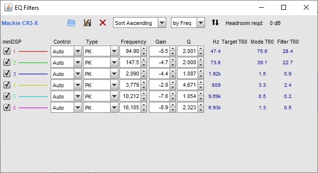

# The Definitive Flat Tuning & EQ Guide for Mackie CR3 / CR3-X (3.5") 🎚️🔊

> **The all-in-one acoustic tuning guide and free EQ presets to fix the sound of Mackie CR3 / CR3-X / CR3-X BT desktop speakers.** Turn colored, boomy multimedia speakers into honest, balanced reference monitors for **music production, gaming, video editing, and everyday listening**.

---

## 🎯 Who Is This For?

This guide is designed for **anyone who owns Mackie CR3 / CR3-X (3.5") speakers and wants them to sound significantly better**:

* 🎵 **Music Producers & Beatmakers:** Get a truly flat, uncolored frequency response so your mixes translate accurately to cars, AirPods, and club sound systems without muddy bass or dark vocals.
* 🎮 **Gamers & Streamers:** Clean up bloated mid-bass so you can clearly hear enemy footsteps, directional audio cues, and voice chat without deafening explosion rumble.
* 🎬 **Video Editors & Content Creators:** Bring dialogue forward and remove boxy resonances for clean voiceover and podcast editing.
* 🎧 **Music Lovers & Everyday Listeners:** Experience your favorite Spotify albums and movies with rich, balanced detail and zero high-frequency ear fatigue.

---

## 📖 Table of Contents
* [The Common Problems with Stock Mackies](#-the-common-problems-with-stock-mackies)
* [The Objective Measurements & Science](#-the-objective-measurements--science)
* [Step 1: Essential Physical Hacks (Free)](#-step-1-essential-physical-hacks-free)
* [Step 2: The Universal Parametric EQ Calibration Profile](#-step-2-the-universal-parametric-eq-calibration-profile)
* [Step 3: Setup Guides by Platform & Software](#-step-3-setup-guides-by-platform--software)
  * [FL Studio (Included .fst Preset)](#a-fl-studio-recommended-for-production)
  * [Windows System-Wide (Equalizer APO + Peace)](#b-windows-system-wide-spotify-gaming-youtube)
  * [macOS System-Wide (CamillaDSP + BlackHole)](#c-macos-system-wide-spotify-youtube-movies)
  * [Other DAWs (Ableton, Logic Pro, Reaper, Pro Tools)](#d-other-daws-ableton-logic-reaper)
* [Dual-Reference Monitoring Workflow (Monitors + Headphones)](#-dual-reference-monitoring-workflow)
* [Mackie CR3-X vs. PreSonus Eris E3.5: The Truth](#-mackie-cr3-x-vs-presonus-eris-e35-the-truth)
* [Frequently Asked Questions (FAQ)](#-frequently-asked-questions-faq)
* [Repository Files](#-repository-files)
* [Scientific References & Credits](#-scientific-references--credits)

---

## 🚨 The Common Problems with Stock Mackies

Out of the box, the **Mackie CR3-X (3.5")** are marketed as *"Creative Reference"* monitors, but objective acoustic measurements reveal an aggressive **"V-shaped" (or "smiley face") sound signature**:

1. **Bloated Mid-Bass (+8.5 dB at ~95–150 Hz):** Engineered by the manufacturer to make small 3-inch drivers sound "punchy" on showroom floors, but creating a muddy, resonant "one-note boom" in real rooms.
2. **Scooped / Recessed Midrange (500 Hz – 2.5 kHz):** Vocal body, snare fundamentals, and instrument presence are pulled back by 4 to 5 dB, making singers sound like they are performing behind a thick curtain.
3. **Hyped Treble (+7 to +9 dB from 10 kHz to 16 kHz):** An artificial high-end sizzle that creates fake "clarity" while inducing severe ear fatigue after 30–45 minutes of listening.

### Why this ruins your music mixes (The Mix Translation Trap):
* **The Bass Trap:** Because the speakers artificially boost mid-bass by +8.5 dB, you instinctively **cut bass** in your mix. When played in cars or clubs, your track ends up sounding **thin, weak, and hollow**.
* **The Treble Trap:** Because the speakers over-hype high-frequency sizzle, you **cut highs** in your DAW. On headphones or phone speakers, your mix sounds **dull and muffled**.
* **The Vocal Trap:** Because the midrange is scooped, you push vocal levels **too loud** to hear them.

**Calibrating to a Flat (neutral) response fixes this.** A flat monitor acts as a clean magnifying glass: what you hear is what is actually in the audio file.

---

## 🔬 The Objective Measurements & Science

Based on standardized Klippel Near-Field Scanner (NFS / ANSI/CTA-2034-A) anechoic measurements (conducted by *Erin’s Audio Corner* and indexed on *Spinorama.org*):

| Acoustic Metric | Stock Mackie CR3-X | Calibrated with this Profile |
| :--- | :---: | :---: |
| **Harman Tonality Preference Score** | **`2.5 / 10`** (Poor / Colored) | **`~5.0 / 10`** (Good / Studio Reference) |
| **Frequency Linearity Deviation** | `±4.4 dB` | **`±1.5 dB`** |
| **100 Hz Port Boom Peak** | `+8.5 dB` | **Tamed to Flat (0 dB)** |
| **16 kHz Treble Sizzle Peak** | `+8.9 dB` | **Tamed to Flat (0 dB)** |
| **Midrange Presence (1k–3k)** | Scooped by 4–5 dB | **Restored to Neutral Reference** |

---

## 🛠️ Step 1: Essential Physical Hacks (Free)

Before applying digital EQ, complete these two zero-cost physical adjustments:

### 1. The "Rolled Sock" Port Hack 🧦
* **What to do:** Roll up a pair of clean cotton socks (or insert dense open-cell foam) and push one snugly into the rear circular bass port of each speaker.
* **The Acoustic Physics:** Small ported cabinets use a rear resonant tube tuned to ~100 Hz to fake bass output. This causes severe time-domain ringing, phase smearing, and air whooshing ("chuffing"). Plugging the port converts the cabinet into an **acoustic suspension (sealed enclosure)**, yielding much faster transient response, snappy bass note articulation, and a smooth natural low-end rolloff.

### 2. Elevate to Ear Level & Decouple 📐
* Never leave desktop monitors sitting flat on a bare desk surface. Desktop reflections cause comb filtering that muddies the lower midrange.
* Use foam monitor pads, yoga blocks, or desktop stands to raise the tweeters to **exact ear level** and angle them toward your head in an equilateral triangle.

---

## 🎛️ Step 2: The Universal Parametric EQ Calibration Profile

All filters utilize **negative gains (cuts)**. This preserves dynamic range and guarantees **zero digital clipping**:

| Filter # | Type | Frequency | Gain | Q Factor | Target Acoustic Problem Fixed |
| :---: | :---: | :---: | :---: | :---: | :--- |
| **1** | Peaking (PK) | **94.9 Hz** | **-8.5 dB** | **2.00** | Cuts the artificial 100 Hz port boom |
| **2** | Peaking (PK) | **147.5 Hz** | **-4.7 dB** | **2.00** | Cleans up muddy lower-mid cabinet resonance |
| **3** | Peaking (PK) | **2,090 Hz** | **-4.4 dB** | **1.09** | Restores vocal/instrument balance across crossover |
| **4** | Peaking (PK) | **3,779 Hz** | **-2.8 dB** | **4.67** | Smooths out an upper-mid resonance spike |
| **5** | Peaking (PK) | **10,212 Hz** | **-7.6 dB** | **1.05** | Tames the bright, fatiguing treble shelf |
| **6** | Peaking (PK) | **16,105 Hz** | **-8.9 dB** | **2.32** | Eliminates ultra-high artificial air sizzle |

> ⚠️ **Note on Sub-Bass (< 65 Hz):** Small 3.5" drivers physically cannot reproduce deep sub-bass below 65 Hz. **Do not boost frequencies below 60 Hz with EQ**, as this will introduce heavy driver distortion and drain amplifier headroom. Check deep sub-bass on headphones.

---

## 💻 Step 3: Setup Guides by Platform & Software

### A. FL Studio (Recommended for Production)
This repository includes a ready-to-use preset: [`Mackie CR3-X Flat Reference.fst`](Mackie%20CR3-X%20Flat%20Reference.fst).

1. Copy `Mackie CR3-X Flat Reference.fst` to:
   * **macOS:** `~/Documents/Image-Line/FL Studio/Presets/Plugin presets/Effects/Fruity Parametric EQ 2/`
   * **Windows:** `Documents\Image-Line\FL Studio\Presets\Plugin presets\Effects\Fruity Parametric EQ 2\`
2. Open **FL Studio**, press `F9` for Mixer, and click the **Master track**.
3. Add **Fruity Parametric EQ 2** to the **last slot (Slot 10)**.
4. Click **Presets** $\rightarrow$ select **`Mackie CR3-X Flat Reference`**.
5. ⚠️ **Golden Rule:** Click the **green mute dot** next to Slot 10 before rendering/exporting your final song so the speaker EQ isn't printed into your final audio file!

### B. Windows System-Wide (Spotify, Gaming, YouTube)
1. Download and install [Equalizer APO](https://sourceforge.net/projects/equalizerapo/) and [Peace GUI](https://sourceforge.net/projects/peace-equalizer-apo-extension/).
2. Select your audio interface/output in the Configurator.
3. Import [`mackie_cr3x_equalizer_apo.txt`](mackie_cr3x_equalizer_apo.txt) into Peace GUI or Equalizer APO's Configuration Editor.

### C. macOS System-Wide (Spotify, YouTube, Movies)
For global macOS playback, this repo includes a zero-latency CoreAudio DSP configuration using **CamillaDSP** and **BlackHole 2ch**:
* Config file: [`camilladsp_config.yml`](camilladsp_config.yml)
* Allows a **1-click toggle** in the macOS menu bar:
  * Select **BlackHole 2ch** $\rightarrow$ Flat EQ active for Mackies.
  * Select **USB AUDIO CODEC** $\rightarrow$ Raw direct bypass for headphones.

### D. Other DAWs (Ableton, Logic, Reaper)
1. Insert any 6-band Parametric EQ (FabFilter Pro-Q, Ableton EQ Eight, Logic Channel EQ, ReaEQ) onto your **Monitor FX / Control Room** chain (or last slot on Master).
2. Enter the exact Frequency, Gain, and Q values from the table in Step 2.
3. Save as a DAW preset.

---

## 🎧 Dual-Reference Monitoring Workflow

If you pair your Mackies with studio headphones (such as the **Audio-Technica ATH-M40x**, **Sony MDR-7506**, or **Sennheiser HD 600**):

| Audio Task | Best Listening Tool | Calibration EQ Status |
| :--- | :---: | :---: |
| **Composing, Arranging, Panning, Reverb Balances** | **Mackie 3.5** | **EQ ON** |
| **Vocal Intelligibility & Dialogue Editing** | **Mackie 3.5** | **EQ ON** |
| **Sub-Bass & 808 Tuning (< 65 Hz)** | **Studio Headphones** | **EQ BYPASSED (MUTED)** |
| **Audio Cleanup, Click/Pop Removal, Tuning** | **Studio Headphones** | **EQ BYPASSED (MUTED)** |

---

## ⚖️ Mackie CR3-X vs. PreSonus Eris E3.5: The Truth

A common debate online is whether the **PreSonus Eris E3.5** is better than the **Mackie CR3-X**:

* **Stock Out-of-the-Box:** In standardized anechoic lab tests, the stock PreSonus Eris E3.5 actually measured with **an even more aggressive and harsh treble peak** than the Mackie CR3-X.
* **Acoustic Knobs:** The physical knobs on the back of the PreSonus are broad-band tone controls; they cannot fix narrow acoustic resonances at 95 Hz or 3.8 kHz.
* **The Reality:** Both speakers use 3.5" woofers and suffer from the same small-cabinet physics. However, once the port is plugged and this 6-band PEQ profile is applied, the **Mackie CR3-X achieves an exceptionally smooth, neutral response** that matches or beats monitors costing twice as much.

---

## ❓ Frequently Asked Questions (FAQ)

#### Q: Why does the volume sound lower when I turn on the EQ?
Because the stock speakers artificially boost mid-bass and treble by almost **+9 dB** (which the human ear perceives as nearly twice as loud). The EQ cuts those fake peaks down to match the true level of the midrange. Simply turn up the physical volume knob on your audio interface or speaker to compensate!

#### Q: Can I boost sub-bass (40–50 Hz) with an EQ to get more bass?
**No.** A 3.5-inch woofer cannot physically reproduce deep sub-bass. Boosting below 60 Hz will cause heavy harmonic distortion, voice coil heat, and push the small amplifier into clipping. For deep sub-bass, rely on good studio headphones.

#### Q: Will this calibration work on older Mackie CR3 models?
**Yes.** The original Mackie CR3 and newer CR3-X share nearly identical driver dimensions, cabinet volume, and port resonances. This profile delivers a massive improvement on both generations.

---

## 📂 Repository Files

* [**`Mackie CR3-X Flat Reference.fst`**](Mackie%20CR3-X%20Flat%20Reference.fst) — Ready-to-use FL Studio plugin preset.
* [**`mackie_cr3x_equalizer_apo.txt`**](mackie_cr3x_equalizer_apo.txt) — Standard Equalizer APO / Peace / REW filter configuration.
* [**`camilladsp_config.yml`**](camilladsp_config.yml) — CamillaDSP YAML configuration for CoreAudio / Linux.
* [**`rew_eq_settings.png`**](rew_eq_settings.png) — Graphical frequency response reference chart.
* [**`REVERSE_UNINSTALL.txt`**](REVERSE_UNINSTALL.txt) — Uninstallation guide for macOS background tools.
* [**`uninstall.sh`**](uninstall.sh) — 1-click removal script.

---

## 📜 Scientific References & Credits

* Objective Klippel Near-Field Scanner (ANSI/CTA-2034-A) measurement dataset by [Erin's Audio Corner](https://www.erinsaudiocorner.com/loudspeakers/mackie_cr3x/).
* Standardized frequency response curves and Harman preference scoring indexed on [Spinorama.org](https://www.spinorama.org).
* Additional acoustic analysis and port-tuning research by [NoAudiophile](https://noaudiophile.com/Mackie_CR3/).

---

## ⚖️ License
Released under the [MIT License](LICENSE). Free for personal, commercial, and educational use.
